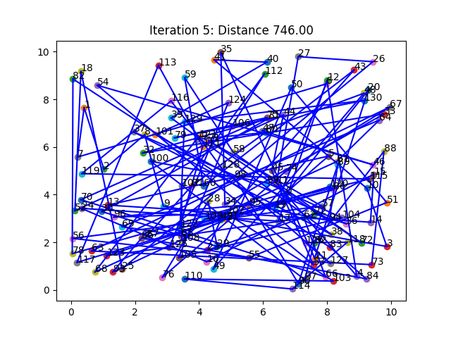

# Metaheuristic-algorithms-ACO-AFSA-BHA
METAHEURISTICS AND STOCHASTIC SEARCH ALGORITHMS - ACO - AFSA - BHA

## **Algorithms**

- [x] Ant colony optimization - ACO
- [x] Artificial Fish Swarm Algorithm - AFSA
- [x] Harmony Search Algorithm - HSA

# **Algorithm Details**
## **1 - Ant colony optimization - ACO**

This project implements an Ant Colony Optimization (ACO) algorithm to solve the Traveling Salesman Problem (TSP). The algorithm is inspired by the foraging behavior of ants and uses pheromone trails to find the shortest path between a set of cities.

### Project Structure

- `ACO/ant_colony.py`: Contains the implementation of the Ant Colony Optimization algorithm.
- `ACO/test_acp.py`: Contains a test script to run the ACO algorithm on a sample distance matrix.

### **Algorithm Steps**

**Parameters**

- `noThieves`: The number of thieves in the population.

- `distances (2D numpy.array)`: Square matrix of distances. Diagonal is assumed to be np.inf.
- `n_ants (int)`: Number of ants running per iteration
- `n_best (int)`: Number of best ants who deposit pheromone
- `n_iteration (int)`: Number of iterations
- `decay (float)`: Rate it which pheromone decays. The pheromone value is multiplied by decay, so 0.95 will lead to decay, 0.5 to much faster decay.
- `alpha (int or float)`: exponenet on pheromone, higher alpha gives pheromone more weight. Default=1
- `beta (int or float)`: exponent on distance, higher beta give distance more weight. Default=1

### Installation

To run this project, you need to have Python and NumPy installed. You can install NumPy using pip:

```bash
pip install numpy
```

### Usage
 1 Clone the repository:

```bash
git clone https://github.com/amine-sabbahi/Metaheuristic-algorithms-ACO-AFSA-BHA.git
cd ant_colony_optimization/ACO
```
 2 Run the test script:

```bash
python test_acp.py
```
### ACO Result



## Contact

For any questions or suggestions, please contact [mohamedamine.sabbahi@etu.uae.ac.ma].


